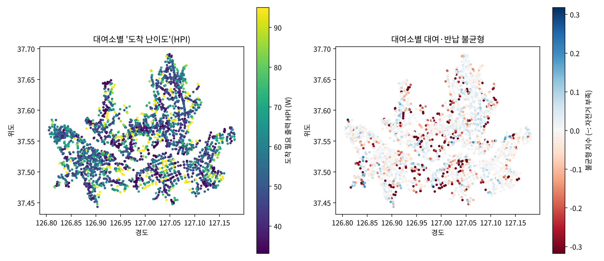
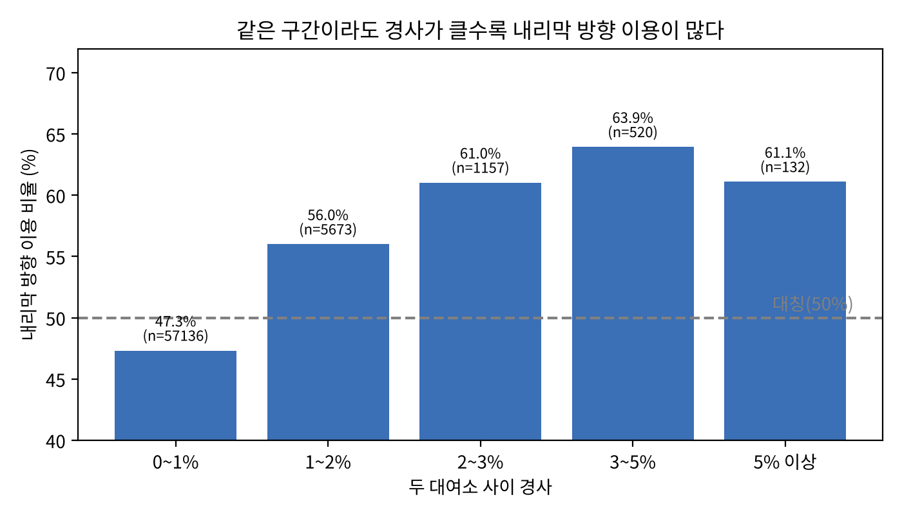

# 오르막의 '힘'을 재다 — 따릉이 언덕 이동격차 분석 (Hill Power Index)

**팀 오르락** · AI와 함께하는 교통문제 해결을 위한 데이터 분석 공모전 (한겨레 × 재단법인 숲과나눔, 2026)

[](https://colab.research.google.com/github/pros1127-glitch/ororak-ddareungi/blob/main/run_colab.ipynb)  ← 설치 없이 브라우저에서 바로 실행 (`run_colab.ipynb`)

경사 보정 자전거 필요동력 지수(HPI)로 서울 따릉이 대여소의 '도착 난이도'를 계산하고,
대여·반납 불균형과 오르막/내리막 방향 비대칭을 분석한 뒤 전기자전거 우선배치 대여소를 도출하는 코드입니다.

### 핵심 결과 (2026년 6월, 통행 4,161,207건 · 대여소 2,721개)
- 평지 55W → 경사 3% 163W: 이 '힘'을 지표로 만든 것이 HPI(W)
- HPI와 대여·반납 불균형의 상관 ρ = −0.505 (자치구 군집 부트스트랩 95% CI −0.566 ~ −0.441), 해발고도(ρ = −0.398)보다 강함
- 언덕 대여소(HPI 상위 20%)가 하루 순유출의 52%(2,855대) 차지
- 같은 두 대여소 사이에서 경사 1%p마다 내리막 방향 이용 오즈 1.43배
- Random Forest R²: 기본 변수 −0.005 → 경사·동력 변수 추가 0.462 (자치구 단위 공간 교차검증 0.423)

| | |
|---|---|
|  |  |

`results/` 폴더에 보고서에 쓴 그림 5개와 결과 요약(`results_summary.txt`), 우선배치 30곳 목록이 들어 있습니다.

## 1. 설치 (내 PC에서 실행할 때 — Colab은 설치 불필요)
```bash
pip install -r requirements.txt
```

## 2. 원본 데이터 (아래 3-(B) 방식으로 직접 집계할 때만 필요 · 서울 열린데이터광장, 무료)
| 파일 | 데이터셋 | 저장 위치 |
|---|---|---|
| 대여소 정보 (.xlsx) | 서울시 공공자전거 따릉이 대여소 정보 (OA-13252) https://data.seoul.go.kr/dataList/OA-13252/F/1/datasetView.do | `data/` |
| 대여이력 (.csv, 월별 약 700MB) | 서울시 공공자전거 따릉이 대여이력 정보 (OA-15182) https://data.seoul.go.kr/dataList/OA-15182/F/1/datasetView.do | `data/trips/` |

- 대여이력은 **1개월(예: 2026년 6월)** 만 받아도 충분합니다. 여러 달을 넣으면 자동으로 합산합니다.
- 고도(해발)는 코드가 Open Topo Data API(SRTM 30m)에서 자동 조회합니다(약 1분, 인터넷 필요).
  결과는 `outputs/elevation_cache.csv`에 저장되어 다음 실행부터는 다시 조회하지 않습니다.
  국토지리정보원 DEM 등 더 정밀한 고도를 쓰려면 `station_id,elev` 형식 CSV를 만들어 `--elev-csv`로 넣으세요.

## 3. 실행

### (A) 저장소 파일만으로 바로 재현 — 권장
원본 대여이력(733MB)은 GitHub에 올릴 수 없어서, 이를 출발–도착 대여소별 통행 수로 집계한 파일(`data/od_2606.csv.gz`, 1.3MB)을 함께 올려 두었습니다.
이 파일로 실행해도 원본으로 실행한 것과 **결과가 완전히 같습니다**(약 2~5분).
```bash
python analysis.py --stations data/stations_2606.xlsx --od data/od_2606.csv.gz --elev-csv data/elevation_srtm30m.csv
```

### (B) 원본 대여이력부터 직접 집계
위 2번의 데이터를 내려받아 넣은 뒤 실행합니다(약 5~10분). `--save-od`를 붙이면 집계 파일을 새로 만듭니다.
```bash
python analysis.py --stations data/stations_2606.xlsx --trips "data/trips/*.csv" --elev-csv data/elevation_srtm30m.csv --save-od data/od_2606.csv.gz
```
`--elev-csv`를 빼면 고도를 Open Topo Data API에서 새로 조회합니다.

### 저장소에 포함된 데이터
| 파일 | 내용 | 출처 |
|---|---|---|
| `data/stations_2606.xlsx` | 따릉이 대여소 정보(2026.6 기준, 2,789개) | 서울 열린데이터광장 OA-13252 (공공누리 제1유형) |
| `data/od_2606.csv.gz` (+ `.meta.json`) | 2026년 6월 대여이력 4,161,207건의 출발–도착 대여소별 통행 수 | 서울 열린데이터광장 OA-15182를 집계 |
| `data/elevation_srtm30m.csv` | 대여소별 고도(SRTM 30m) | Open Topo Data |

## 4. 결과 (`outputs/`)
| 파일 | 내용 | 보고서 위치 |
|---|---|---|
| `results_summary.txt` | 보고서에 옮길 핵심 수치 [결과1]~[결과4] | 분석 내용 및 결과 |
| `fig1_power_curve.png` | 경사별 필요 출력(물리 모델) | 분석 과정 |
| `fig2_station_maps.png` | 대여소별 도착 난이도 / 불균형 지도 | 결과1 |
| `fig3_downhill_asymmetry.png` | 경사 구간별 내리막 방향 이용 비율 | 결과2 |
| `fig4_ml.png` | ML 성능(R²) 비교, 변수 중요도 | 결과3 |
| `fig5_priority_equity.png` | 전기자전거 우선배치 대여소, 자치구별 언덕 대여소 비율 | 결과4 |
| `ebike_priority_top30.csv` | 우선배치 상위 30 대여소 목록 | 정책제안 |
| `district_summary.csv`, `station_features.csv`, `results.json` | 상세 결과 | 부록/발표 |

## 5. 주요 가정 (analysis.py 상단에서 수정 가능)
- 탑승자 70kg + 따릉이 18kg, 기준속도 15km/h, 구름저항계수 0.008, CdA 0.6m², 공기밀도 1.2kg/m³
- 직선거리 → 경로거리 보정 1.3배, 0.3km 미만 구간은 경사 계산 제외(고도 오차 때문)
- 편안한 출력 100W, 부담 기준 150W
- 탄소 시나리오: 승용차 대체율 5/10/20%, 승용차 배출계수 0.13kgCO2/km (중형차 1인·km, World Watch Institute 계수 — 그린포스트코리아 2020.6.7 인용)

## 6. 분석 흐름
1. 대여소 위치 + 고도 → 반경 0.3~2km 이웃에서 이 대여소로 올 때의 평균 필요 출력(HPI_in) 계산
2. 대여이력 → 대여소별 대여·반납 불균형, 같은 두 대여소 간 오르막/내리막 방향 이용 비율
3. Random Forest(5-fold CV)로 경사 변수 추가 전후 설명력(R²) 비교, permutation importance
4. 반사실 추정(경사 부담을 평지 수준으로 낮췄을 때 예측 이용량) → 잠재 수요
5. 우선배치 점수 = 도착난이도 40% + 순유출 30% + 잠재수요 30% (백분위) → 상위 30곳, 탄소감축 시나리오
